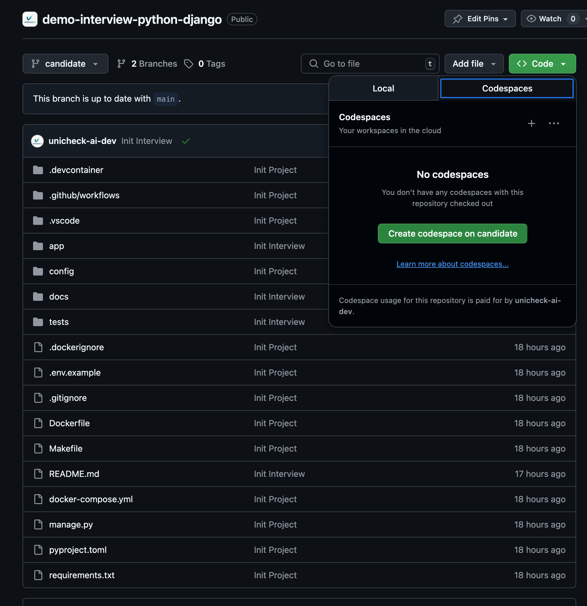

# Unicheck.ai Technical Interview Demo – Django REST Edition

Welcome! This repository is an **automatically generated demo interview** produced by [unicheck.ai](https://unicheck.ai).

It demonstrates how the platform turns a job description into a realistic, production-like technical assignment.

Powered by an **agent‑based architecture** – every stage, from vacancy parsing to the candidate's solution scoring, is performed by specialised LLM agents.

As a result, each candidate receives a unique, production-grade project as a test task, and hiring managers receive a multi-angle, evidence-based assessment.

### How the system works

1. **Post your vacancy** – paste the job description. That’s all we need to start.
1. **Skill map generation** – unicheck.ai analyses the job description and extracts the exact knowledge, tools, and seniority your role requires.
1. **Interview assembly** – for each candidate, we spin up a fresh GitHub repo with unique tasks tailored specifically for a given position. The interview tasks include genuine bugs, anti‑patterns, optimisation needs, or missing features.
1. **Invite the candidate** – a private repo is provisioned for the candidate (GitHub **username** is enough).
1. **Candidate action** – they open the GitHub Codespaces, fulfill the requirements of the task, and open a Pull Request.
1. **Automated review** –  analysis agents inspect the code, tests, and commit history alongside static analysis and style checks; a detailed report is produced.
1. **Adjust & repeat** – hiring teams can edit requirements or regenerate tasks at any point.

Each interview repo is **unique**, medium-sized **production-like** service, so solutions cannot be reused between candidates. 

All tooling is **fully configured** and **ready to launch**, so candidates can start coding immediately in a ready-to-work environment.


### Role demonstrated: 
*Middle Python / Django Developer*


# Interview description for the candidate: Django Interview

Welcome to the live‑coding stage of our hiring process.
You will work on a compact yet production‑style Django REST project. Issues reported by product, marketing, and finance have been turned into auto-tests.

**Your goal is to address those issues and keep all tests green.**

### What's included

- A ready‑to‑run Django application.
- Pre‑configured infrastructure (PostgreSQL, Redis, Docker, devcontainer).
- A comprehensive test suite. All tests should stay green.

## Business stories to address

[See the task list](docs/tasks.md)

## Getting started

- Select the prepared git branch `candidate`
- Go `Code` -> `Codespaces` -> `Create codespace on candidate`:

[](docs/codespaces_example.png)

- You will find a ready-made, fully operational dedicated workspace to solve the interview. Take any action to solve the problem, keep the project working, and make sure that all the tests are passing.

## Requirements
- Commit each task separately.
- When all interview tests are done, open **one** Pull Request with your solution.
- All tests must be successfully passed. For `tests/interview/`, the removal of the decorator `@pytest.mark.xfail` is mandatory.
- Your solution will be evaluated externally. In addition to test results, the following aspects will be considered:
    - code quality and style
    - architectural and implementation decisions
    - adherence to industry best practices
    - the amount of time invested in completing the task
- Creative solutions are welcome if they meet quality standards.

### ⏱ Time‑box

The task is designed to be solved not more than **1 hour**. Focus on clear, incremental fixes.

### Helpful commands

Use the terminal to run:

- `make interview` to run interview tests to check your solutions.
- `make test` to run common project tests to ensure that common features are still working.
- `make lint` to run linters and formatters.
- see more useful commands in the `Makefile`.

Good luck and enjoy!

## About Project

A back-end service that lets travelers discover nearby points of interest, build day-by-day itineraries and reserve limited time-slot attractions — all through a RESTful JSON API. Local tour operators manage their attractions’ availability while end-users assemble personal schedules and place bookings that respect capacity and timing rules. The system stores geo-spatial data for proximity search, supports multilingual content, and guarantees seats by applying row-level locks inside transactional booking flows.

[see more details](docs/)

### Tech Stack

- Python: 3.11
- Django: 4
- API: Django REST Framework
- Database: PostgreSQL 15
- Caching: Redis 7
- Testing: Pytest, Pytest-Django
- Architecture: Service Pattern, Resource-Based API
- Dependency Management: `requirements.txt`


### Project Structure Overview
```bash
> tree -a -I .git|.github|.gitignore|.devcontainer|.dockerignore|.vscode|.idea|__pycache__|.mypy_cache|alembic|.pytest_cache|__init__.py|.venv|node_modules|dist|build --gitignore
.
├── .env.example
├── app
│   ├── admin.py
│   ├── api
│   │   ├── exceptions.py
│   │   ├── pagination.py
│   │   ├── permissions.py
│   │   ├── serializers.py
│   │   ├── urls.py
│   │   └── views.py
│   ├── apps.py
│   ├── migrations
│   │   └── 0001_initial.py
│   ├── models.py
│   └── services.py
├── config
│   ├── asgi.py
│   ├── settings.py
│   ├── urls.py
│   └── wsgi.py
├── docker-compose.yml
├── Dockerfile
├── docs
│   ├── codespaces_example.png
│   └── README.md
├── Makefile
├── manage.py
├── pyproject.toml
├── README.md
├── requirements.txt
└── tests
    ├── api
    │   ├── test_api_basic.py
    │   ├── test_api_itinerary_stats.py
    │   ├── test_api_poi_geo.py
    │   ├── test_api_schedule.py
    │   ├── test_auth_permissions.py
    │   └── test_heapth.py
    ├── conftest.py
    ├── models
    ├── test_core_models.py
    └── test_services.py

8 directories, 35 files

```

---
Contact: [info@unicheck.ai ](mailto:info@unicheck.ai)
